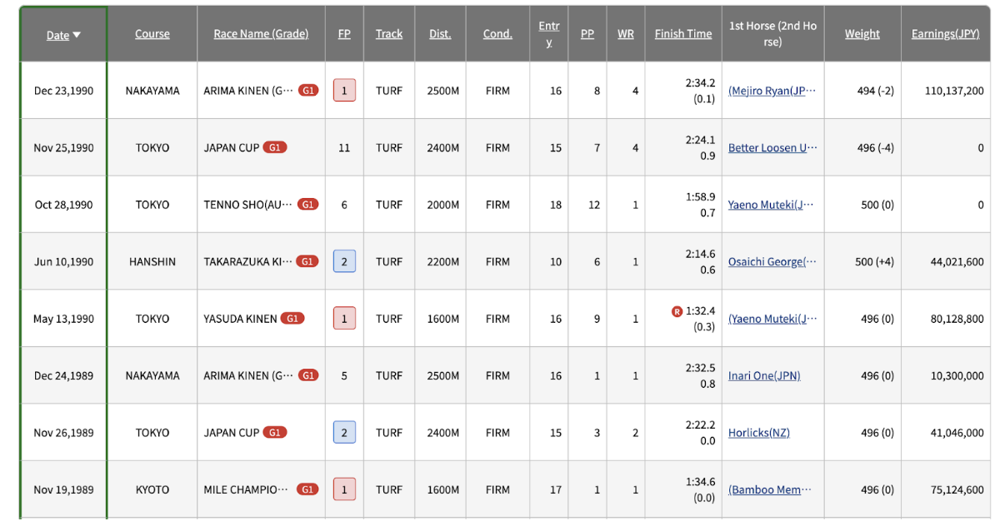
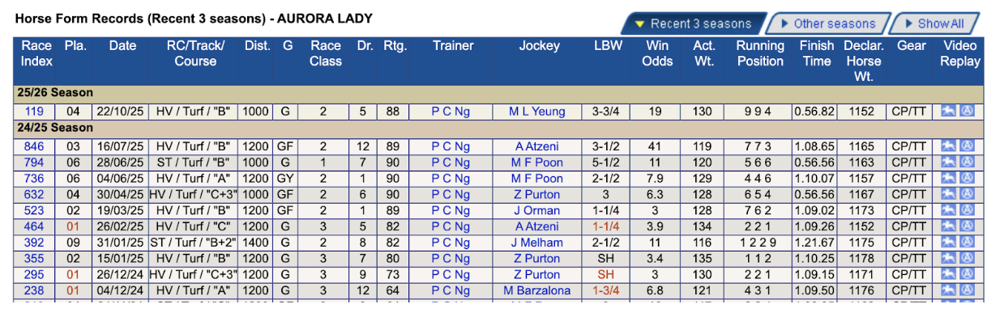

## Project Title: The Oguri Model

## Authors: Ryan Duong, Andrei Duque
Andrei Duque (Github: https://github.com/aduques)
Ryan Duong (Github: https://github.com/gyordong)

## Installation Requirements

pandas 2.3+
numpy 2.0+
scikit-learn 1.7+
matplotlib 3.10+

## Description of Question and Research Topic (5 Sentences)
Throughout this project, we want to identify the common characteristics that Japanese Race Horse winners and Hong Kong Race Horse winners have and determine if there are characteristics that dominating horses tend to have. We want to be able to predict metrics that are used to measure the likelihood of a horse winning a race and its competitive dominance, such as race times and winning margins. Since the two datasets have different attributes recorded, we have to find the common attributes, and find out what the relationship of the available data is and the predicted race times and winning margins (multiple linear regression model).

Next, we want to use the predicted values in combination with the available horse and race attributes, to determine the probability that a horse will win a race (logistic regression model). To make things more entertaining, this model will simulate a race, where the highest probability amongst a select number of horses will be declared as the winner.

## Project Outline/Plan

### Data Collection Plan (two parts, one for each author)
If allowed: https://www.kaggle.com/datasets/takamotoki/jra-horse-racing-dataset/data
Will use the common attributes from JRA dataset and the UK/Ireland dataset

Otherwise (more preferred): https://www.jbis.jp/

Using the data from the JBIS database, we will individually select 100 (or more, if desired) horses and record the necessary attributes. It is important to choose attributes that also exist in the Hong Kong Jockey Club database, so that comparisons can be made.

The following attributes would be scraped from the database and used to train the models:
Date
Course
Track
Dist. (Distance)
Cond. (Condition)
Finish Time
FP (Finish Position)
1st Horse (2nd Horse) (margin)
Weight
Sex

Example page from the JBIS database:

Margin and Finish Time will also be the predicted values for the multiple linear regression models.

Since there are multiple races with different statistics for each horse, it is likely
that we will find the average for each statistic to represent each horse.

Hong Kong Race Horses (Ryan):
If allowed: https://www.kaggle.com/datasets/deltaromeo/horse-racing-results-ukireland-2015-2025/data
If these kaggle datasets are allowed, then the topic would change from comparing Japanese Race Horses and Hong Kong Race Horses to Japan Race Horses and European Race Horses.

Otherwise (more preferred): https://racing.hkjc.com/racing/information/english/Horse/SelectHorse.aspx

Using the data from the Hong Kong Jockey Club database, we will individually select 100 (or more, if desired) horses and record the necessary attributes. It is important to choose attributes that also exist in the JBIS database, so that comparisons can be made.

The following attributes would be scraped from the database and used to train the models:
Date
RC/Track/Course (Race Condition, Track)
Dist. (Distance)
Length Behind Winner (LBW)
Finish Time
Declar. Horse Wt. (Weight) / Act. Wt.
Pla. (Placed)
Sex

Example page from Hong Kong Jockey Club database:

Margin and Finish Time will also be the predicted values for the multiple linear regression models.

Since there are multiple races with different statistics for each horse, it is likely
that we will find the average for each statistic to represent each horse.

### Model Plans (two parts, one for each author)
Model Plans (Andrei) :
Mini model 1 (multiple linear regression model): We want to use distance, surface, track condition, age, sex, horse weight and be able to predict what the horse's time is.

Model Plans (Ryan):
Mini model 2 (multiple linear regression model): To measure how dominant a horse is in a race (raises likeliness to win a race), we want to use the predicted horse’s time, race grade, distance, condition, field strength (turf or dirt?), and use it to predict the margin (distance between the winning horse and second place).

Model Plans (Andrei/ Ryan):
Main model (logistic regression): Using the predicted values, and the horse attributes (these are also used in mini models, nothing new introduced), we want to predict whether a horse will win. The weights for this model will also likely include race attributes such as distance and condition which are needed since races have different conditions.

### Project Timeline

Project Timeline:

10/26 - Submit Proposal for Problem of the Week

11/2 Find Appropriate Datasets/Gather Relevant Data

11/9 Finish Data Preprocessing

11/16 Test first iterations of models 

11/23 Continue tuning hyperparameters

11/30 Write conclusions on results + finish presentation slides

12/2 - Presentations

12/11 - Final Submission

### Future Work

* Modify hyperparameters like learning rate
* Update with present data
* Identify more features to increase accuracy
